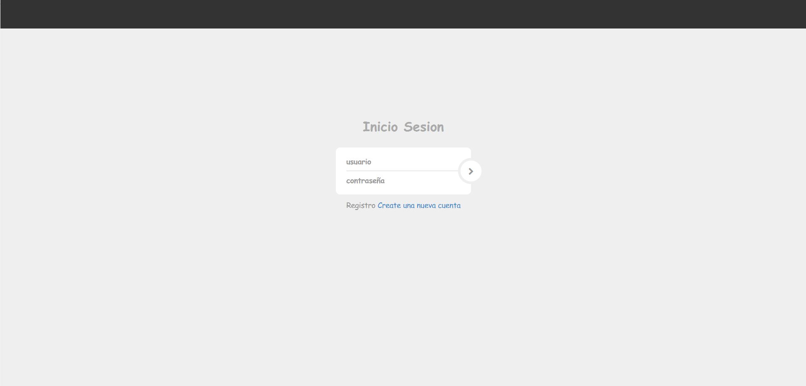
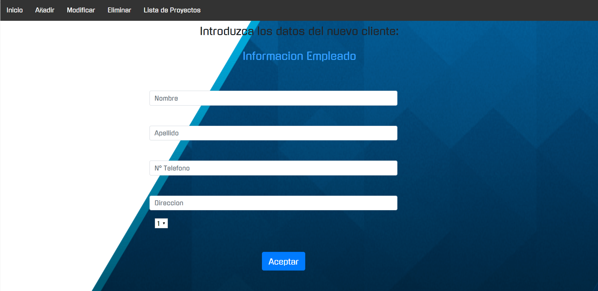
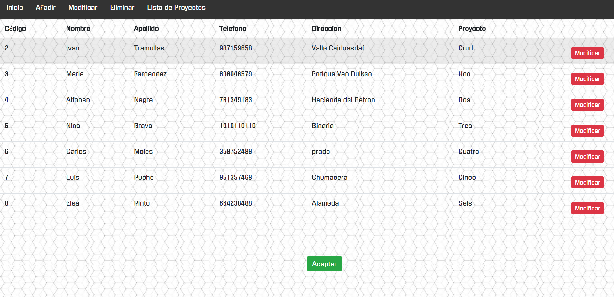
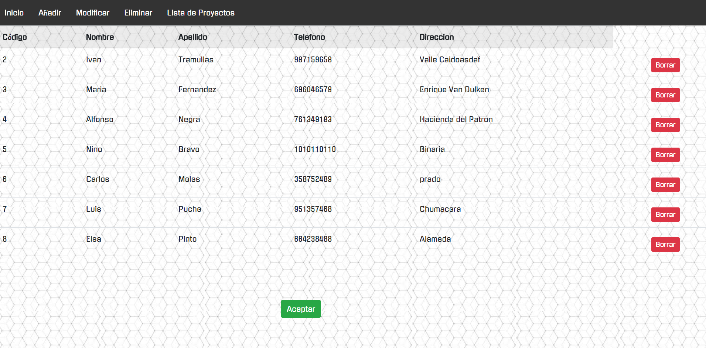
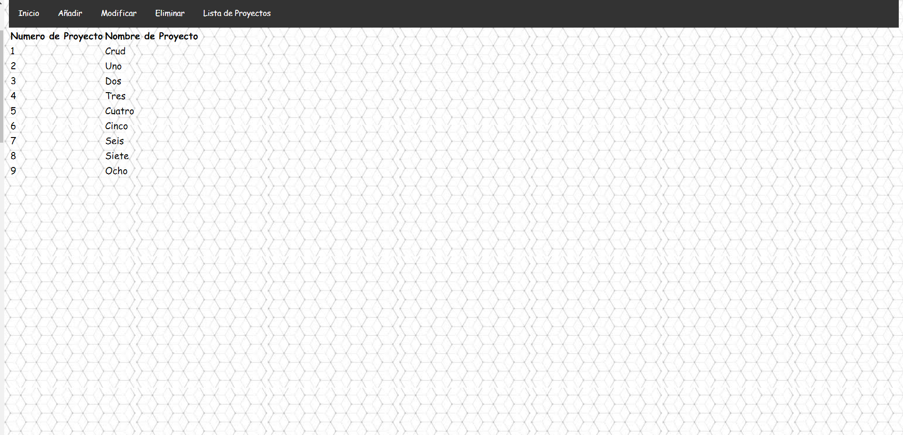

# CrudDatosFinal
En esta nueva versión he incorporado un login en el cual has de registrarte para poder loguearte en la aplicacion, ademas de esto, he incorporado la el hashmap y utilizado un patron Dao en el proyecto , tambien he cambiado la organizacion de las paginas y su acceso asi como el estilo css.
### Login de la aplicacion.

### Tabla Principal

### Alta de usuarios.

### Tabla de Modificacion

### Tabla de Baja/Eliminacion

### Lista de Proyectos.

