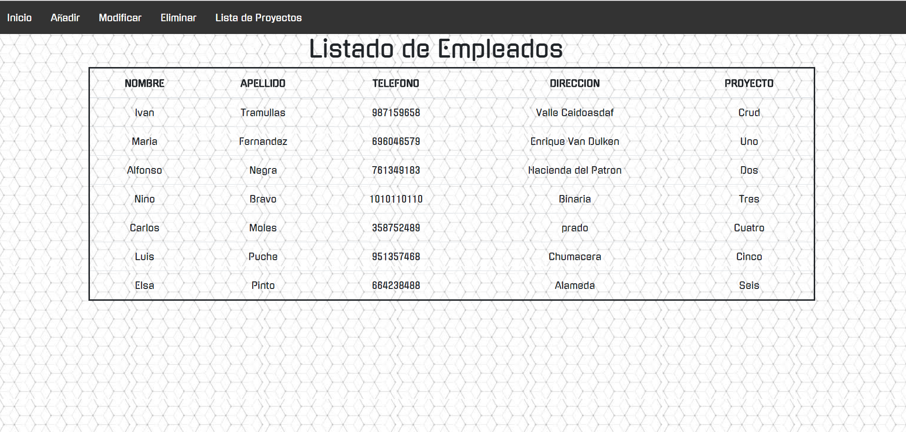

# CrudDatosFinal
En esta nueva versión he incorporado un login en el cual has de registrarte para poder loguearte en la aplicacion, ademas de esto, he incorporado la el hashmap y utilizado un patron Dao en el proyecto , tambien he cambiado la organizacion de las paginas y su acceso asi como el estilo css.
### Login de la aplicacion.


### Tabla Principal


### Alta de usuarios.


### Tabla de Modificacion


### Tabla de Baja/Eliminacion


### Lista de Proyectos.


Por ultimo el codigo del Hash-Map que no le pude mostrar

```java
 
            HashMap<String, String> listaProyectos = new HashMap();
            listaProyectos.put("1", "Crud");
            listaProyectos.put("2", "Uno");
            listaProyectos.put("3", "Dos");
            listaProyectos.put("4", "Tres");
            listaProyectos.put("5", "Cuatro");
            listaProyectos.put("6", "Cinco");
            listaProyectos.put("7", "Seis");
            listaProyectos.put("8", "Siete");
            listaProyectos.put("9", "Ocho");
        
```
